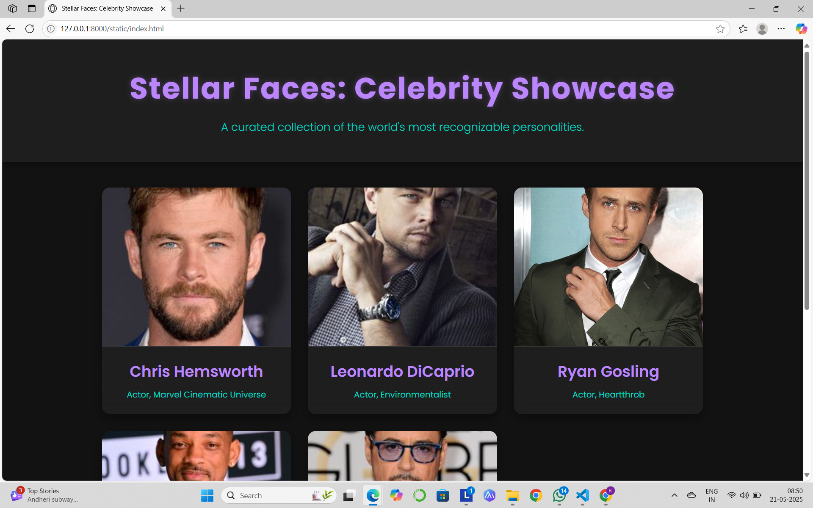
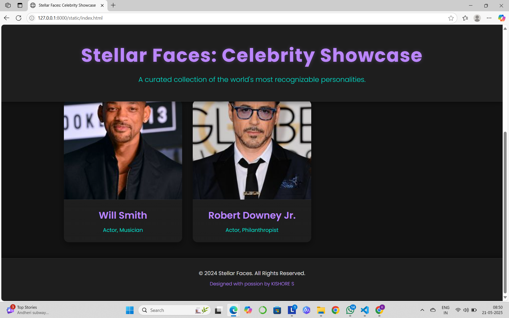

# Ex.08 Design of Interactive Image Gallery
## Date: 21/05/25


## AIM:
To design a web application for an inteactive image gallery with minimum five images.

## DESIGN STEPS:

### Step 1:
Clone the github repository and create Django admin interface.

### Step 2:
Change settings.py file to allow request from all hosts.

### Step 3:
Use CSS for positioning and styling.

### Step 4:
Write JavaScript program for implementing interactivity.

### Step 5:
Validate the HTML and CSS code.

### Step 6:
Publish the website in the given URL.

## PROGRAM :

```
<!DOCTYPE html>
<html lang="en">
<head>
    <meta charset="UTF-8">
    <meta name="viewport" content="width=device-width, initial-scale=1.0">
    <title>Stellar Faces: Celebrity Showcase</title>
    <link href="https://fonts.googleapis.com/css2?family=Poppins:wght@300;400;600;700&display=swap" rel="stylesheet">
    <style>
        :root {
            --background-dark: #121212;
            --card-background: #1e1e1e;
            --text-light: #e0e0e0;
            --accent-color: #bb86fc; /* A vibrant purple for accent */
            --secondary-accent: #03dac6; /* A teal for secondary elements */
            --border-color: #333333;
            --shadow-color: rgba(0, 0, 0, 0.4);
        }

        * {
            margin: 0;
            padding: 0;
            box-sizing: border-box;
        }

        body {
            font-family: 'Poppins', sans-serif;
            background-color: var(--background-dark);
            color: var(--text-light);
            line-height: 1.6;
            min-height: 100vh;
            display: flex;
            flex-direction: column;
            scroll-behavior: smooth;
        }

        header {
            background: var(--card-background);
            text-align: center;
            padding: 3rem 1rem;
            border-bottom: 1px solid var(--border-color);
            box-shadow: 0 4px 15px var(--shadow-color);
            position: sticky;
            top: 0;
            z-index: 1000;
        }

        header h1 {
            font-size: 3.5rem;
            margin-bottom: 0.75rem;
            color: var(--accent-color);
            letter-spacing: 2px;
            font-weight: 700;
            text-shadow: 0 0 10px rgba(187, 134, 252, 0.3);
        }

        header p {
            font-size: 1.3rem;
            color: var(--secondary-accent);
            font-weight: 300;
        }

        main {
            flex-grow: 1;
            padding: 3rem 2rem;
            max-width: 1200px;
            margin: 0 auto;
            width: 100%;
        }

        .gallery-grid {
            display: grid;
            grid-template-columns: repeat(auto-fit, minmax(280px, 1fr));
            gap: 2rem;
        }

        .gallery-item {
            background-color: var(--card-background);
            border-radius: 15px;
            overflow: hidden;
            box-shadow: 0 8px 20px var(--shadow-color);
            transition: transform 0.4s cubic-bezier(0.25, 0.8, 0.25, 1), box-shadow 0.4s ease-in-out;
            cursor: pointer;
            position: relative;
            transform-style: preserve-3d;
            perspective: 1000px;
        }

        .gallery-item:hover {
            transform: translateY(-10px) rotateX(2deg);
            box-shadow: 0 12px 25px rgba(187, 134, 252, 0.3);
        }

        .gallery-item img {
            width: 100%;
            height: 300px; /* Fixed height for consistency */
            object-fit: cover;
            display: block;
            transition: transform 0.4s ease-in-out;
            border-radius: 15px 15px 0 0;
        }

        .gallery-item:hover img {
            transform: scale(1.05);
        }

        .info-panel {
            padding: 1.5rem;
            text-align: center;
            background: linear-gradient(180deg, var(--card-background) 0%, rgba(30, 30, 30, 0.9) 100%);
            border-top: 1px solid var(--border-color);
        }

        .info-panel h3 {
            font-size: 1.8rem;
            color: var(--accent-color);
            margin-bottom: 0.5rem;
            font-weight: 600;
        }

        .info-panel p {
            font-size: 1rem;
            color: var(--secondary-accent);
        }

        .modal {
            display: none;
            position: fixed;
            z-index: 2000;
            left: 0;
            top: 0;
            width: 100%;
            height: 100%;
            background-color: rgba(0, 0, 0, 0.95);
            display: flex;
            justify-content: center;
            align-items: center;
            opacity: 0;
            visibility: hidden;
            transition: opacity 0.3s ease-in-out, visibility 0.3s ease-in-out;
        }

        .modal.open {
            opacity: 1;
            visibility: visible;
        }

        .modal-content {
            background-color: var(--card-background);
            padding: 2rem;
            border-radius: 15px;
            box-shadow: 0 10px 30px var(--shadow-color);
            max-width: 90%;
            max-height: 90%;
            position: relative;
            display: flex;
            flex-direction: column;
            align-items: center;
            transform: scale(0.9);
            transition: transform 0.3s cubic-bezier(0.25, 0.8, 0.25, 1);
        }

        .modal.open .modal-content {
            transform: scale(1);
        }

        .modal-content img {
            max-width: 100%;
            max-height: 70vh;
            border-radius: 10px;
            object-fit: contain;
            margin-bottom: 1.5rem;
            border: 1px solid var(--border-color);
        }

        .modal-content h3 {
            font-size: 2.2rem;
            color: var(--accent-color);
            margin-bottom: 1rem;
            font-weight: 700;
        }

        .modal-content p {
            font-size: 1.1rem;
            color: var(--text-light);
            text-align: center;
        }

        .close-button {
            position: absolute;
            top: 15px;
            right: 15px;
            color: var(--secondary-accent);
            font-size: 2.5rem;
            font-weight: bold;
            cursor: pointer;
            transition: color 0.3s ease-in-out, transform 0.3s ease-in-out;
            background: none;
            border: none;
            padding: 0;
        }

        .close-button:hover {
            color: var(--accent-color);
            transform: rotate(90deg);
        }

        footer {
            text-align: center;
            padding: 2rem 1rem;
            background: var(--card-background);
            color: var(--text-light);
            margin-top: auto; /* Pushes footer to the bottom */
            border-top: 1px solid var(--border-color);
            box-shadow: 0 -4px 15px var(--shadow-color);
        }

        footer p {
            font-size: 1rem;
            margin-bottom: 0.5rem;
            color: var(--text-light);
        }

        .footer-credits {
            font-size: 0.9rem;
            color: var(--accent-color);
            font-weight: 300;
        }

        /* Responsive adjustments */
        @media (max-width: 768px) {
            header h1 {
                font-size: 2.5rem;
            }

            header p {
                font-size: 1rem;
            }

            main {
                padding: 2rem 1rem;
            }

            .gallery-grid {
                grid-template-columns: repeat(auto-fit, minmax(250px, 1fr));
            }

            .gallery-item img {
                height: 250px;
            }

            .info-panel h3 {
                font-size: 1.5rem;
            }

            .modal-content {
                padding: 1.5rem;
            }

            .modal-content h3 {
                font-size: 1.8rem;
            }
        }

        @media (max-width: 480px) {
            header {
                padding: 2rem 1rem;
            }
            header h1 {
                font-size: 2rem;
            }
            header p {
                font-size: 0.9rem;
            }
            main {
                padding: 1.5rem 1rem;
            }
            .gallery-grid {
                grid-template-columns: 1fr; /* Single column on very small screens */
            }
            .gallery-item img {
                height: 200px;
            }
            .info-panel h3 {
                font-size: 1.3rem;
            }
            .modal-content {
                padding: 1rem;
            }
            .modal-content h3 {
                font-size: 1.5rem;
            }
            .close-button {
                font-size: 2rem;
            }
        }
    </style>
</head>
<body>
    <header>
        <h1>Stellar Faces: Celebrity Showcase</h1>
        <p>A curated collection of the world's most recognizable personalities.</p>
    </header>

    <main>
        <section class="gallery-grid">
            <div class="gallery-item" data-name="Chris Hemsworth" data-bio="An Australian actor known for playing Thor in the Marvel Cinematic Universe.">
                
                <div class="info-panel">
                    <h3>Chris Hemsworth</h3>
                    <p>Actor, Marvel Cinematic Universe</p>
                </div>
            </div>
            <div class="gallery-item" data-name="Leonardo DiCaprio" data-bio="An American actor and film producer, known for his performances in biopics and period films.">
                
                <div class="info-panel">
                    <h3>Leonardo DiCaprio</h3>
                    <p>Actor, Environmentalist</p>
                </div>
            </div>
            <div class="gallery-item" data-name="Ryan Gosling" data-bio="A Canadian actor and musician, famous for his roles in independent films and major blockbusters.">
                
                <div class="info-panel">
                    <h3>Ryan Gosling</h3>
                    <p>Actor, Heartthrob</p>
                </div>
            </div>
            <div class="gallery-item" data-name="Will Smith" data-bio="An American actor, rapper, and film producer. He has enjoyed success in television, film, and music.">
                
                <div class="info-panel">
                    <h3>Will Smith</h3>
                    <p>Actor, Musician</p>
                </div>
            </div>
            <div class="gallery-item" data-name="Robert Downey Jr." data-bio="An American actor who has starred in numerous films, including the Iron Man series.">
                
                <div class="info-panel">
                    <h3>Robert Downey Jr.</h3>
                    <p>Actor, Philanthropist</p>
                </div>
            </div>
        </section>
    </main>

    <div class="modal" id="myModal">
        <button class="close-button" onclick="closeModal()">&times;</button>
        <div class="modal-content">
            
            <h3 id="modal-name"></h3>
            <p id="modal-bio"></p>
        </div>
    </div>

    <footer>
        <p>&copy; 2024 Stellar Faces. All Rights Reserved.</p>
        <p class="footer-credits">Designed with passion by KISHORE S</p>
    </footer>

    <script>
        document.querySelectorAll('.gallery-item').forEach(item => {
            item.addEventListener('click', function() {
                const modal = document.getElementById('myModal');
                const modalImg = document.getElementById('modal-img');
                const modalName = document.getElementById('modal-name');
                const modalBio = document.getElementById('modal-bio');

                modalImg.src = this.querySelector('img').src;
                modalImg.alt = this.dataset.name;
                modalName.textContent = this.dataset.name;
                modalBio.textContent = this.dataset.bio;

                modal.classList.add('open');
                document.body.style.overflow = 'hidden'; // Prevent scrolling when modal is open
            });
        });

        function closeModal() {
            const modal = document.getElementById('myModal');
            modal.classList.remove('open');
            document.body.style.overflow = ''; 
        }

        
        window.onclick = function(event) {
            const modal = document.getElementById('myModal');
            if (event.target === modal) {
                closeModal();
            }
        }
    </script>
</body>
</html>

```

## OUTPUT:




## RESULT:
The program for designing an interactive image gallery using HTML, CSS and JavaScript is executed successfully.
